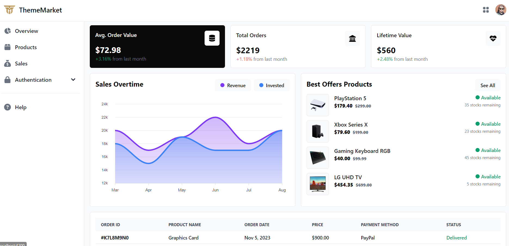
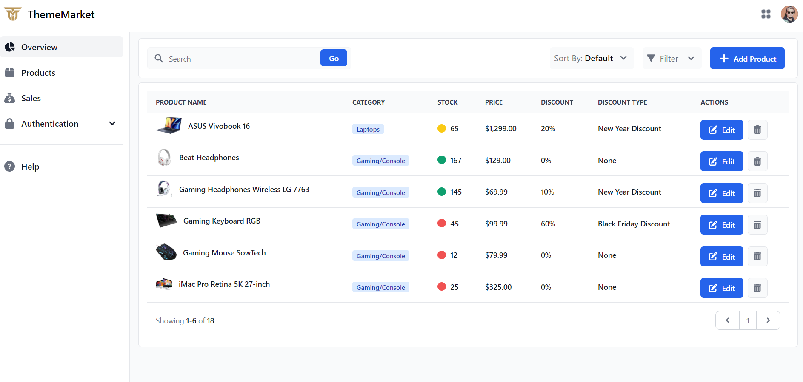
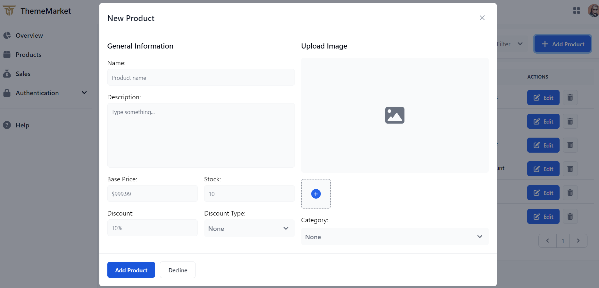
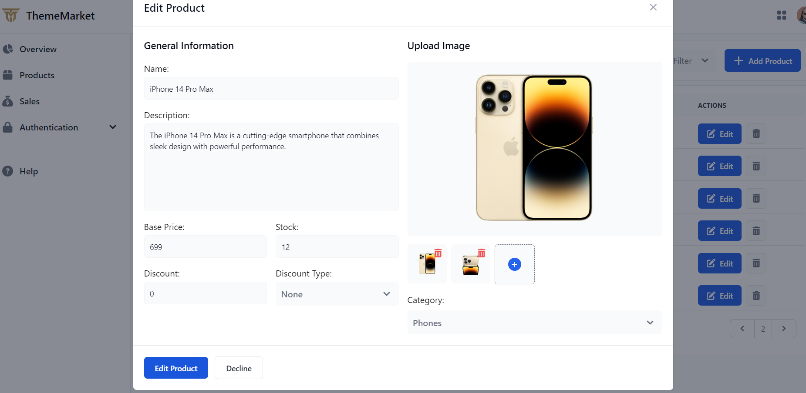
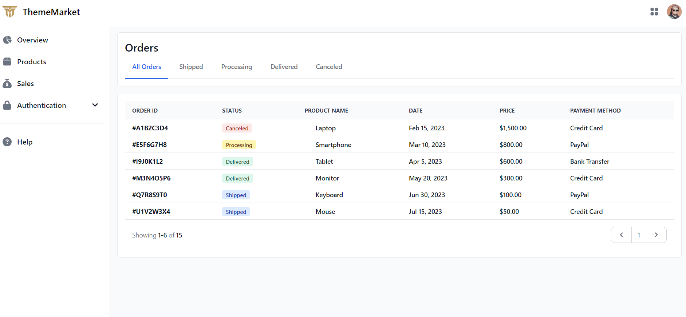
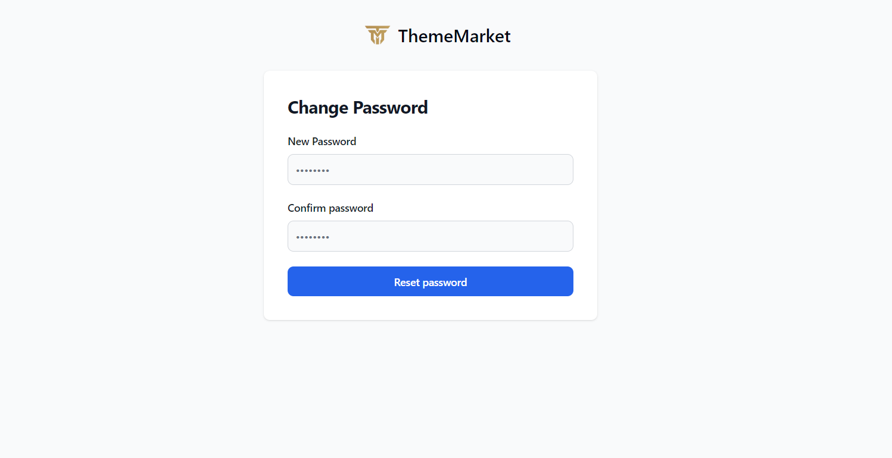
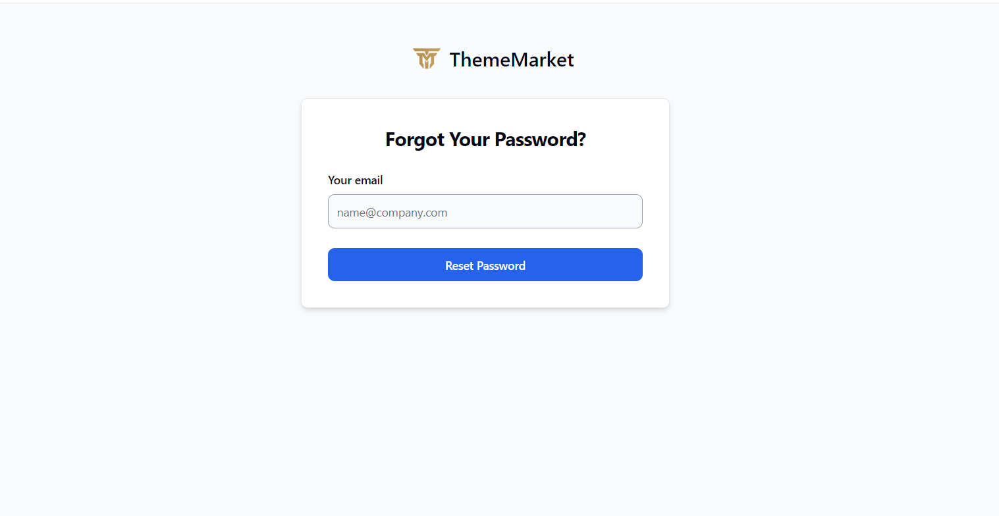

# Admin Dashboard Demo 1

Plantilla de panel de administración de productos totalmente gratuita, desarrollada con Angular 19 y TailwindCSS.

## Características

- Vista general de las ventas.
- Páginas de login, registro y restablecimiento de contraseñas.
- Vista de manipulación, edición y creación de productos funcional.

## Dependencias

- Angular v19.0.0
- Flowbite v2.5.2
- TailwindCSS v3.4.17
- rxjs v7.8.0
- ApexCharts v4.3.0
- ng-apexcharts v1.15.0

## Previews

### Overview Page

<div style="display: flex; justify-content: center;">
    
</div>

### Products Page

<div style="display: flex; flex-wrap: wrap; justify-content: center;">
    
    
    
</div>

### Orders

<div style="display: flex; justify-content: center;">
    
</div>

### Auth

<div style="display: flex; flex-wrap: wrap; justify-content: center;">
    
    
    
    
</div>

## Instalación

### Clona el repositorio

```bash
git clone https://github.com/ThemeMarket/admin-dashboard-demo-1.git
```

### Dirígete al proyecto

```bash
cd admin-dashboard-demo-1
```

### Instala las dependencias

```bash
npm install
```

### Levanta el servidor de desarrollo

```bash
ng serve
```

### Levanta el mock de la API

Por defecto el proyecto usa JSON Server para realizar un mock de la API y servir los productos y las órdenes
desde un archivo JSON, para levantar la API debes ejecutar el siguiente comando:

```bash
npm run mock-api
```
